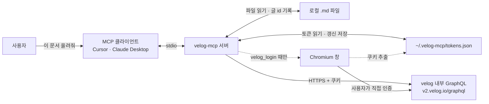
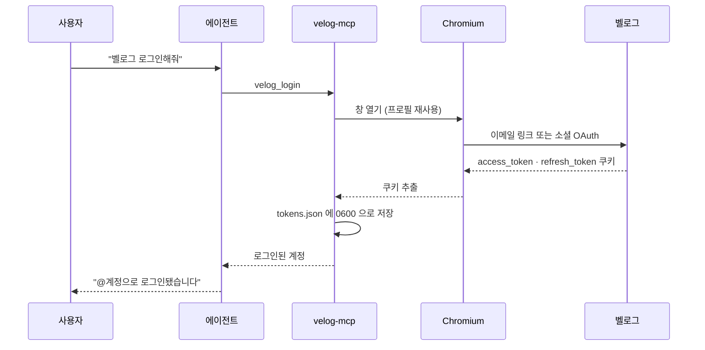
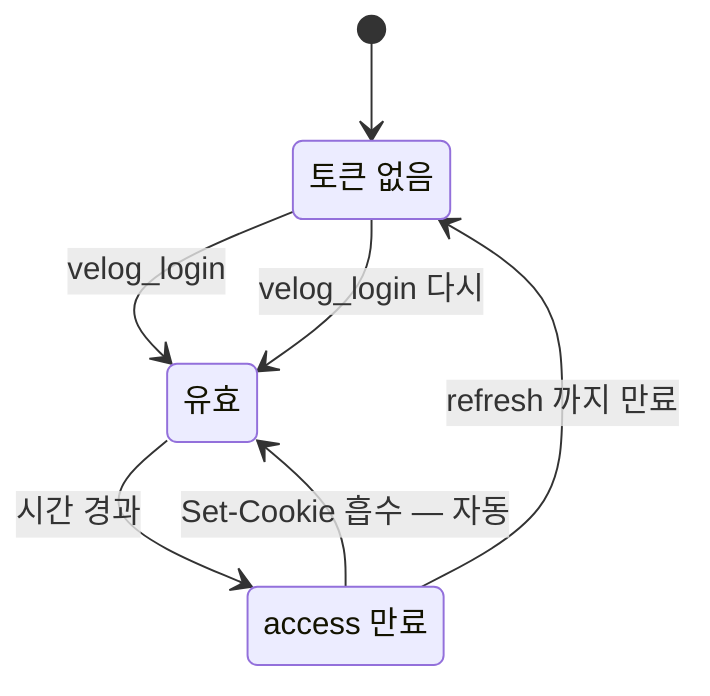
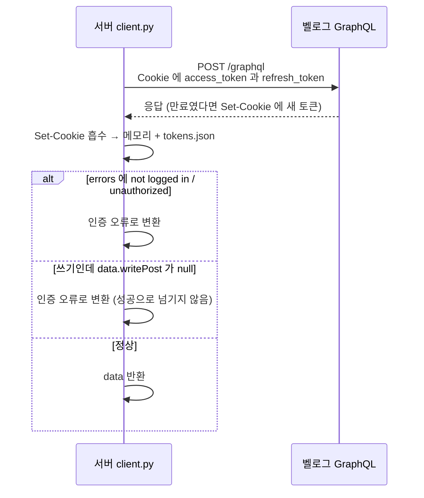
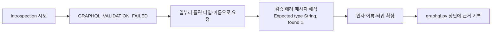
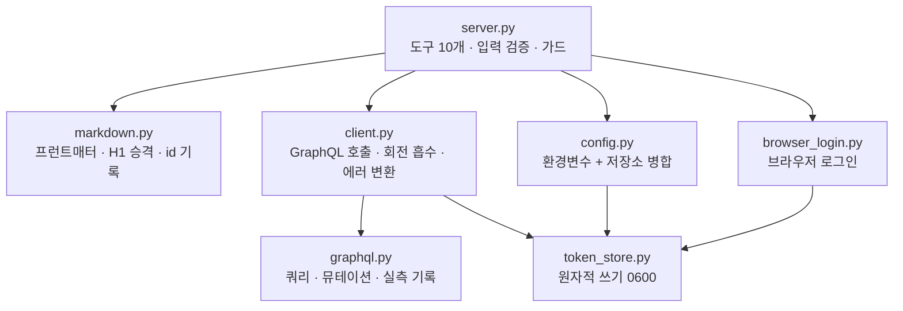

# 동작 방식

← [README](../README.md) · [레퍼런스](reference.md)

왜 이렇게 만들었는지, 그리고 어디가 깨질 수 있는지에 대한 기록.

## 전체 구성

서버는 클라이언트와 stdio로 말하고, 벨로그와는 쿠키를 실은 HTTPS로 말합니다. 토큰은 홈 디렉터리의 파일에, 글 id는 마크다운 파일에 남습니다.



## 왜 아이디·비밀번호를 안 받나

**벨로그에는 비밀번호 로그인이 없습니다.** GraphQL에는 `logout`만 있고 로그인 뮤테이션이 없으며, REST 쪽에도 비밀번호를 받는 엔드포인트가 없습니다(`/api/v2/auth/login` → 404). 열려 있는 것은 이 둘뿐입니다.

| 엔드포인트 | 동작 |
| --- | --- |
| `POST /api/v2/auth/sendmail` | `{"email":"..."}` → 로그인 링크 메일 발송 |
| `GET /api/v2/auth/code/:code` | 메일 속 코드를 토큰으로 교환 |

즉 로그인 수단은 **이메일 매직링크 또는 소셜 OAuth**뿐입니다. 그래서 자격증명을 저장하는 대신, 브라우저에서 한 번 로그인해 쿠키를 받아두고 그 뒤로는 토큰만 관리하는 방식을 택했습니다.



두 번째부터는 브라우저 프로필(`~/.velog-mcp/browser`)이 남아 있어 사람이 손댈 일이 없고, `headless=True`로 부르면 창도 뜨지 않습니다.

## 토큰이 관리되는 방식

인증은 `access_token`·`refresh_token` 쿠키로 합니다. `access_token`이 만료되면 벨로그가 `refresh_token`을 보고 새 토큰을 `Set-Cookie`로 내려주는데, 서버는 응답 헤더에서 그것을 붙잡아 저장소에 반영합니다. 그래서 평소에는 아무것도 하지 않아도 갱신됩니다.



손이 가는 시점은 처음 한 번과, `refresh_token`까지 만료된 경우뿐입니다.

토큰은 `~/.velog-mcp/tokens.json`에 임시 파일로 쓴 뒤 교체하는 방식으로 저장하고, 권한은 `0600`으로 둡니다. 저장에 실패해도 요청 자체는 실패시키지 않고 그 프로세스에서는 메모리 값으로 계속 씁니다.

**단, `Set-Cookie` 회전은 실서버에서 아직 확인되지 않았습니다.** 처리 로직은 로컬 가짜 서버로 5가지 시나리오를 검증했지만(`scripts/verify_token_rotation.py`), 벨로그가 실제로 어떤 조건에서 새 토큰을 내려주는지는 유효한 토큰으로 만료를 겪어봐야 알 수 있습니다. 갱신이 안 되는 것 같으면 `velog_whoami`의 `token_source`를 보고 `scripts/login.py --headless`로 갱신하세요.

## 요청 한 건이 처리되는 과정

회전 흡수와 오류 판정이 모두 이 경로에 모여 있습니다. 흡수한 토큰으로 **그 요청을 재시도하지는 않고**, 다음 요청부터 새 토큰이 실려 나갑니다.



세 번째 분기가 중요합니다. 벨로그는 **미인증 상태에서 `writePost`를 호출해도 GraphQL 에러 없이 `null`만 돌려줍니다.** 그대로 두면 "발행 성공인데 결과가 없다"로 보이므로, 쓰기 결과가 비어 있으면 인증 오류로 바꿔서 알려줍니다.

## 스키마를 어떻게 알아냈나

벨로그의 GraphQL은 **introspection이 막혀 있습니다.** 스키마를 물어보면 `GRAPHQL_VALIDATION_FAILED`가 돌아옵니다. 그래서 일부러 틀린 타입·이름으로 요청을 보내고 검증 에러 메시지를 읽어(예: `Expected type String, found 1.`) 인자 이름과 타입을 하나씩 역추적해 확정했습니다.



따라서 **벨로그가 스키마를 바꾸면 도구가 깨집니다.** 그때 가장 먼저 볼 파일도 `src/velog_mcp/graphql.py`입니다.

### 에러 메시지로 알 수 없었던 두 가지

에러 메시지만으로는 드러나지 않아, **로그인된 브라우저로 벨로그 에디터의 요청을 캡처해 비교**하고 변수를 하나씩 바꿔가며 찾아낸 것들입니다. 둘 다 인증 문제로 착각하기 쉽습니다.

**`meta`는 반드시 객체로 보내야 합니다.** 빼거나 `null`로 보내면 GraphQL 에러 없이 `data.writePost = null`만 돌아옵니다.

| 보낸 값 | 결과 |
| --- | --- |
| `meta` 인자 없음 | `null` |
| `meta: null` | `null` |
| `meta: {}` | 성공 |

**쓰기 뮤테이션 응답에서 `short_description`을 요청하면 안 됩니다.** 벨로그가 이 필드를 만들다 서버에서 터집니다.

```json
{
  "errors": [{ "message": "Cannot read properties of undefined (reading 'replace')",
               "path": ["editPost", "short_description"] }],
  "data": { "editPost": { "id": "...", "url_slug": "..." } }
}
```

글은 저장되는데 응답만 깨지는 **부분 실패**입니다. 그래서 두 가지로 방어합니다. 쓰기 응답에서는 이 필드를 아예 요청하지 않고(`WRITE_RESULT_FIELDS`), `errors`가 있어도 `data`에 결과가 있으면 경고만 남기고 결과를 씁니다. 부분 실패를 예외로 만들면 글은 만들어졌는데 id를 잃어버려 **다음 실행이 중복 글을 만듭니다.** 조회 쿼리에서는 이 필드가 정상 동작하므로 그대로 씁니다.

## 코드 구조



`scripts/` 아래에는 설치 점검(`doctor.py`), 터미널 로그인(`login.py`), 그리고 글을 만들지 않는 검증 스크립트 4개가 있습니다. 자세한 목록은 [레퍼런스](reference.md#스크립트)에 있습니다.

## 기여

이슈·PR 환영합니다.

- 벨로그 스키마 변경으로 깨진 경우: 실패한 도구 이름과 에러 메시지를 함께 적어주세요.
- 새 필드·인자를 추가하는 경우: **어떻게 확인했는지**를 남겨주세요. 스키마가 역추적으로 알아낸 것이라 근거가 다음 사람에게 그대로 자산이 됩니다.

검증 스크립트는 글을 만들지 않습니다. 실제 발행을 시험할 때는 `draft=True` 또는 `VELOG_DRY_RUN=true`를 쓰세요.
