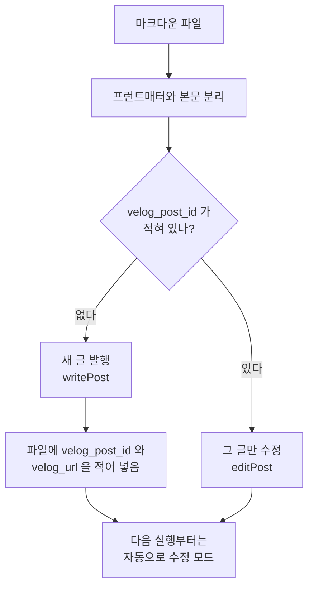
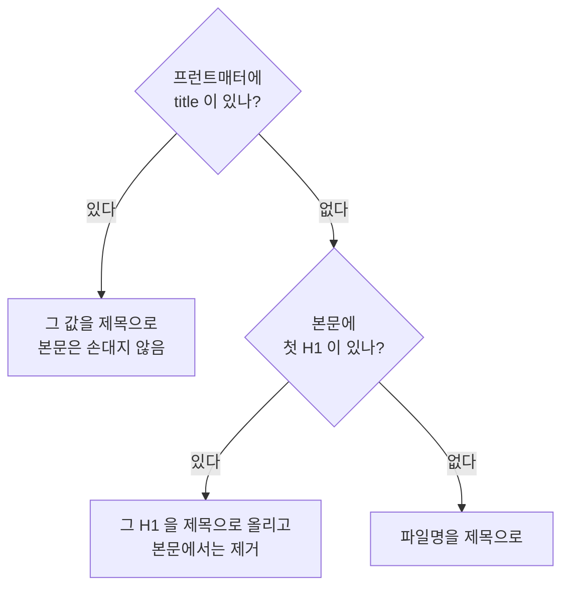
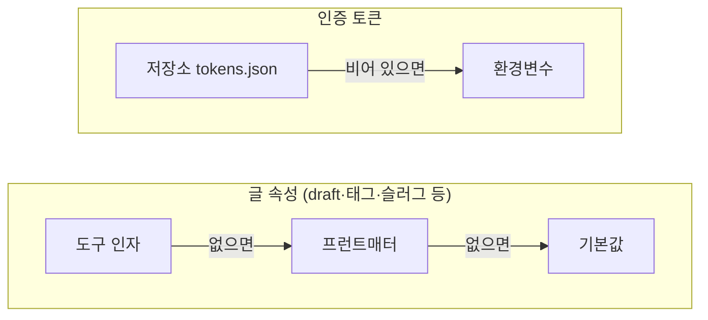
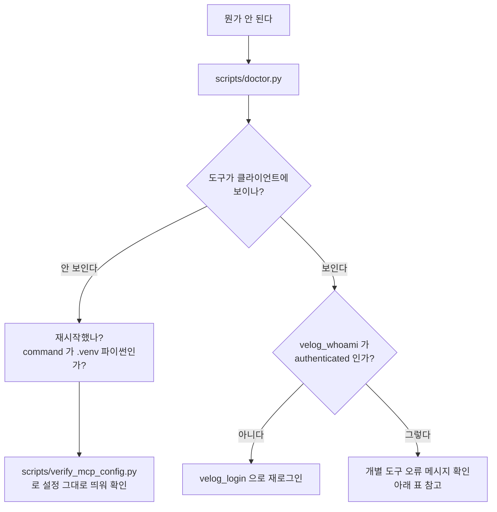

# 레퍼런스

← [README](../README.md) · [동작 방식](how-it-works.md)

## 파일 하나가 처리되는 과정

`velog_publish_markdown_file`은 같은 명령을 반복해도 글이 중복되지 않게 설계됐습니다. 그 갈림길은 프런트매터의 `velog_post_id` 하나입니다.



## 제목이 정해지는 순서



H1을 본문에서 제거하는 이유는 벨로그가 제목을 본문과 따로 렌더링하기 때문입니다. 남겨두면 같은 제목이 두 번 보입니다.

## 값이 겹칠 때 누가 이기나



파일에 `draft: true`가 있어도 `draft=False`로 호출하면 공개됩니다. 토큰은 저장소가 항상 이깁니다. 환경변수는 저장소가 비어 있을 때의 씨앗값 역할만 합니다.

## 프런트매터

| 키 | 타입 | 설명 |
| --- | --- | --- |
| `title` | 문자열 | 제목. 없으면 첫 `# 제목`, 그것도 없으면 파일명 |
| `tags` | 리스트 또는 쉼표문자열 | 태그 |
| `slug` (`url_slug`) | 문자열 | URL 슬러그. 생략하면 벨로그가 제목으로 생성 |
| `thumbnail` | URL | 썸네일 이미지 |
| `private` | 불린 | `true`면 비공개 발행 |
| `draft` | 불린 | `true`면 임시저장 (공개 안 됨) |
| `series_id` | UUID | 시리즈. `velog_list_series`로 UUID 확인 |
| `velog_post_id` | UUID | **도구가 기록.** 있으면 수정 모드 |
| `velog_url` | URL | 도구가 기록 (사람이 보기 위한 값) |

## 환경변수

**모두 선택 사항입니다.** 로그인만 해두면 아무것도 설정하지 않아도 동작합니다. 필요할 때만 클라이언트 설정의 `env` 블록에 넣으세요.

`.env` 파일은 읽지 않습니다. 클라이언트가 서버를 임의의 작업 디렉터리에서 띄우기 때문에, 프로젝트 폴더의 `.env`는 조용히 무시되는 함정이 됩니다.

| 변수 | 기본값 | 설명 |
| --- | --- | --- |
| `VELOG_ACCESS_TOKEN` | 없음 | 토큰을 직접 넣을 때만. 저장소가 비면 씨앗값으로 씀 |
| `VELOG_REFRESH_TOKEN` | 없음 | 위와 같음 (자동 갱신에 필요) |
| `VELOG_USERNAME` | 로그인한 계정 | 조회 대상 기본 계정 (@ 제외) |
| `VELOG_TOKEN_STORE` | `~/.velog-mcp/tokens.json` | 토큰 저장 파일 위치 |
| `VELOG_BROWSER_PROFILE` | `~/.velog-mcp/browser` | 브라우저 로그인 프로필 위치 |
| `VELOG_PERSIST_TOKENS` | `true` | `false`면 갱신 토큰을 파일에 쓰지 않고 메모리에만 둠 |
| `VELOG_DRY_RUN` | `false` | `true`면 실제로 보내지 않고 보낼 내용만 반환 |
| `VELOG_GRAPHQL_ENDPOINT` | `https://v2.velog.io/graphql` | 바꿀 일은 거의 없음 |

`pip install -e .` 없이 쓰려면 `env`에 `"PYTHONPATH": "/absolute/path/to/velog-mcp/src"`를 추가하세요.

## 토큰을 직접 넣기

Playwright를 쓰지 않겠다면 브라우저 개발자도구 → Application → Cookies에서 `velog.io`의 `access_token`·`refresh_token`을 복사해 클라이언트 설정에 넣습니다.

```json
"env": {
  "VELOG_ACCESS_TOKEN": "eyJhbGciOi...",
  "VELOG_REFRESH_TOKEN": "eyJhbGciOi..."
}
```

토큰은 비밀값이니 설정 파일과 `~/.velog-mcp/`가 공유·백업되지 않도록 주의하세요.

## 스크립트

모두 **글을 만들지 않습니다.** 편하게 돌려도 됩니다.

```bash
# 설치 상태 점검 + 등록용 JSON 출력 (막히면 먼저)
./.venv/bin/python scripts/doctor.py

# 브라우저 로그인 (MCP 없이 터미널에서)
./.venv/bin/python scripts/login.py              # 창 띄워 로그인
./.venv/bin/python scripts/login.py --headless   # 창 없이 갱신
./.venv/bin/python scripts/login.py --status     # 저장된 토큰 확인

# 실제 MCP 프로토콜로 조회 도구 호출
#   인자를 주면 그 계정, 생략하면 로그인한 계정
./.venv/bin/python scripts/smoke_test.py
./.venv/bin/python scripts/smoke_test.py some-velog-id

# 마크다운 발행 로직 검증 (프런트매터·H1 승격·수정 모드 전환)
./.venv/bin/python scripts/dry_run_markdown.py

# 토큰 자동 갱신 검증 (로컬 가짜 서버로 Set-Cookie 회전 재현)
./.venv/bin/python scripts/verify_token_rotation.py

# 클라이언트 설정 그대로 띄워 연결 검증
./.venv/bin/python scripts/verify_mcp_config.py

# HTTP 모드를 쓸 때만 필요: 로그인 시 자동 시작 등록 (macOS)
./.venv/bin/python scripts/install_launch_agent.py            # 등록 + 즉시 시작
./.venv/bin/python scripts/install_launch_agent.py --status    # 상태 확인
./.venv/bin/python scripts/install_launch_agent.py --uninstall # 해제
```

## 문제 해결

무엇이 잘못됐는지 모를 때는 이 순서로 좁힙니다.



| 증상 | 원인과 해결 |
| --- | --- |
| 클라이언트에 도구가 안 보임 | 재시작 안 함, 또는 `command`가 시스템 파이썬 |
| "로그인 토큰이 없습니다" | `velog_login` 호출 (또는 `scripts/login.py`) |
| "토큰이 만료됐거나 잘못되었습니다" | `refresh_token`까지 만료됨 → 다시 로그인 |
| 쓰기 도구가 인증 오류 | 벨로그가 미인증 쓰기에 `null`만 주므로 인증 오류로 변환된 것 |
| 브라우저가 안 열림 | `./.venv/bin/python -m playwright install chromium` |
| `.env`를 고쳤는데 반영 안 됨 | `.env`는 읽지 않음. 클라이언트 설정의 `env`에 넣을 것 |
| 상대 경로 거부됨 | 파일은 절대 경로로 지정 |
| 조회할 계정을 모른다는 오류 | 로그인하거나 `username`을 직접 지정 |
